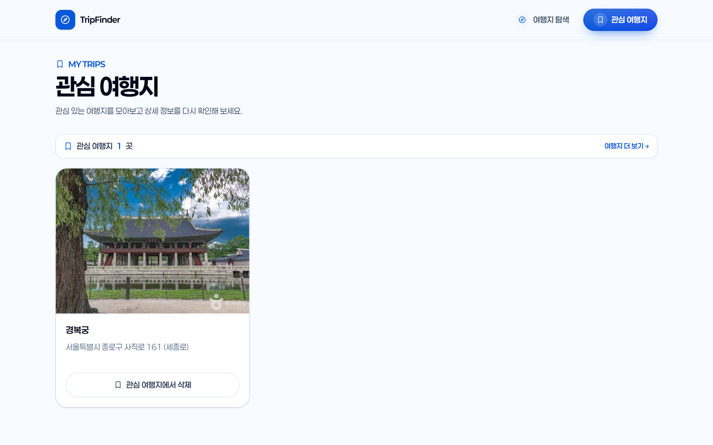

# TripFinder

공공 관광 데이터를 활용해 **지역·카테고리·키워드로 국내 여행지를 탐색하고, 상세 정보를 확인하거나 관심 여행지로 저장하는 반응형 웹서비스**입니다.

Next.js App Router에서 서버와 클라이언트의 역할을 나누고, 외부 API 응답 검증·URL 기반 상태 관리·테스트와 CI까지 설계한 개인 프로젝트입니다.

- **Production**: https://trip-finder-mauve.vercel.app/
- **Portfolio**: https://app.notion.com/p/3e2622cea8638106bf2ce92c1a25543e
- **Technical Document**: https://app.notion.com/p/3e2622cea863810581c9dc081a76bcdf

## 화면

<table>
  <tr>
    <td width="50%" valign="top">
      
      <br />
      <sub>홈 — 키워드 검색과 빠른 탐색으로 여행지 탐색을 시작합니다.</sub>
    </td>
    <td width="50%" valign="top">
      
      <br />
      <sub>탐색 — 키워드·지역 필터와 URL 기반 조건으로 결과를 조회합니다.</sub>
    </td>
  </tr>
  <tr>
    <td width="50%" valign="top">
      
      <br />
      <sub>상세 — 이미지, 주소, 저장·공유·지도 이동을 한 화면에서 제공합니다.</sub>
    </td>
    <td width="50%" valign="top">
      
      <br />
      <sub>관심 여행지 — 브라우저에 저장한 여행지를 다시 확인하고 삭제합니다.</sub>
    </td>
  </tr>
</table>

## 핵심 역량

| 주제                     | 구현                                                                                                                                   |
| ------------------------ | -------------------------------------------------------------------------------------------------------------------------------------- |
| **Server / Client 경계** | Home·Explore·Detail은 Server Component 중심으로 렌더링하고, 종속 필터·북마크처럼 브라우저 상태가 필요한 부분만 Client Component로 분리 |
| **외부 API 데이터 처리** | TourAPI 응답을 `unknown → Zod → Normalizer → Domain Model → UI`로 검증·정규화해 화면과 외부 DTO를 분리                                 |
| **상태 설계**            | 검색·필터·정렬·페이지를 URL Search Params로 관리해 새로고침·직접 접근에서도 탐색 조건을 복원                                           |
| **품질 보증**            | Vitest·React Testing Library·Playwright·axe-core·GitHub Actions로 unit/component·E2E·접근성을 검증                                     |

## 주요 기능

- **여행지 탐색**: 지역 → 시군구, 관광 분류 1 → 2 → 3단계 종속 필터, 키워드 검색, 정렬·페이지네이션, 카드·목록·지도 보기 전환
- **상세 정보**: 이미지 갤러리·확대, 개요·유형별 정보, 주소 복사, 링크 공유, 지도·공식 홈페이지 이동
- **관심 여행지**: localStorage 기반 저장·삭제, 손상된 저장 데이터 복구, 목록과 버튼의 실시간 상태 동기화
- **검색 노출·접근성**: metadata, robots.txt, sitemap.xml, 장소 구조화 데이터와 키보드 조작 가능한 이미지 모달 제공

## 설계와 문제 해결

```text
TourAPI response (unknown)
        ↓
   Zod schema validation
        ↓
      Normalizer
        ↓
     Domain model
        ↓
         UI
```

| 문제                                                      | 해결                                                                          |
| --------------------------------------------------------- | ----------------------------------------------------------------------------- |
| TourAPI 서비스 키가 이중 인코딩되어 403 응답              | 환경변수 경계에서 키를 정규화하고 URL 인코딩은 `URLSearchParams`에 일임       |
| 빈 목록의 `items: ""`, 상세정보 ID 중복 등 응답 계약 차이 | Schema와 normalizer에서 예외 응답을 흡수하고 안정적인 domain ID를 생성        |
| 북마크 변경이 화면마다 즉시 반영되지 않음                 | 저장 데이터를 Zod로 검증하고 `useSyncExternalStore`로 버튼·목록 상태를 동기화 |

## Tech Stack

| 구분     | 기술                                                                        |
| -------- | --------------------------------------------------------------------------- |
| Frontend | Next.js 16.3.5, React 19.2.8, TypeScript 5 (strict), Tailwind CSS 4         |
| Data     | 한국관광공사 TourAPI, Zod 4, Leaflet, OpenStreetMap                         |
| Quality  | Vitest, React Testing Library, Playwright, axe-core, GitHub Actions, Vercel |

## Verification

| 항목              | 결과                                                                                                |
| ----------------- | --------------------------------------------------------------------------------------------------- |
| Unit / Component  | Vitest **29개 파일 / 153개 테스트** 통과                                                            |
| E2E / 접근성      | Playwright 핵심 흐름 **8개 시나리오**와 axe 자동 검사 통과                                          |
| 정적 검사·배포    | ESLint, TypeScript strict, Next.js production build, GitHub Actions CI, Vercel Production 검증 완료 |
| Lighthouse Mobile | Home **99** / Explore **68** / Detail **85** Performance, Accessibility 전 페이지 **100**           |

## Getting Started

```bash
npm install

# .env.local
TOUR_API_SERVICE_KEY=your_service_key

npm run dev
```

| Script              | 설명                         |
| ------------------- | ---------------------------- |
| `npm run lint`      | ESLint 검사                  |
| `npm run typecheck` | TypeScript strict 검사       |
| `npm run test`      | Vitest unit/component 테스트 |
| `npm run test:e2e`  | Playwright E2E 테스트        |
| `npm run build`     | Next.js production build     |

> 실제 TourAPI를 사용하는 E2E에는 유효한 `TOUR_API_SERVICE_KEY`가 필요합니다.

상세한 TourAPI 응답 계약, 캐시 전략, 테스트 설계와 성능 측정 과정은 [Technical Document](https://app.notion.com/p/3e2622cea863810581c9dc081a76bcdf)에 정리했습니다.
